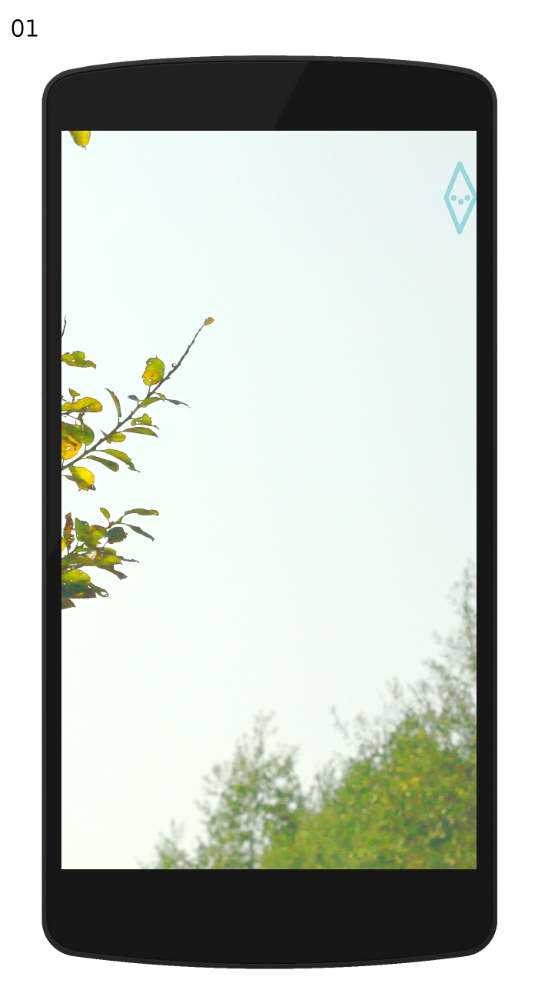
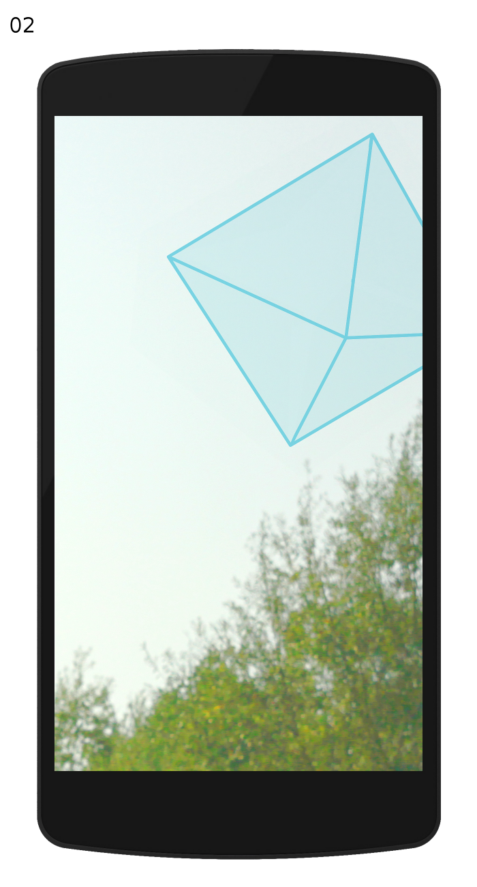

# Konzeption

## Skizzen

Auf eine explizite Darstellung der Funktionen innerhalb der Benutzerschnittstelle wurde verzichtet, um die Motivation für eine selbstständige Erkundung und somit einer etwas längere Auseinandersetzung mit der Applikation zu unterstützen.
In Mockup 01 ist ein Symbol zu sehen, das auf die Richtung hinweist, in die das Mobilgerät zu drehen ist, um das Objekt am Himmel zu entdecken.
In Mockup 02 ist das Objekt selbst zu sehen (s. u. für Interaktionsmöglichkeiten).

## Beeinflussung des Objekts

Das Objekt wird durch Benutzerinteraktion sowie Uhrzeit und Datum manipuliert.

Die Einflussfaktoren sind im Detail:

**Benutzer**

- Objekt antippen (Touch-Geste auf dem Objekt)
    - → Sound-Event auslösen (Dauer des Tons abhängig von Zeit zwischen Antippen und Loslassen)
- Objekt drehen (Wischgeste auf dem Objekt)
    - → Drehgeschwindigkeit und -richtung verändern (Veränderung abhängig von Richtung und Geschwindigkeit der Wischgeste)
- [opt.] Objekt schütteln (Mobilgerät schütteln)
    - → Größenveränderung auslösen (Objekt verliert Kind-Objekte und wird kleiner; Kind-Objekte schwirren umher und vereinigen sich nach einiger Zeit wieder mit dem Objekt)

**Uhrzeit und Datum**

- Uhrzeit
    - → Variation der Farbe (H) abhängig von Tag und Nacht (Farbstich; Verlauf von blau nach gelb)
    - → Variation der Helligkeit (V/L) abhängig von Tag und Nacht (Verlauf von hell nach dunkel)
- Datum
    - → Variation der Sättigung (S) abhängig von der Jahreszeit (Verlauf zwischen kräftigen Farben im Sommer zu blassen Farben im Winter)

**Variation der Objekteigenschaften**

- Ton
    - ← Drehgeschwindigkeit
        - → Tempo (Verlauf: niedrig → niedrig; hoch → hoch)
    - ← Größe
        - → Pitch (Verlauf: klein → hoch; groß → niedrig)
- Farbe (ohnehin 90% transparent)
    - ← Uhrzeit (H; Verlauf: 12:00 → blau; 00:00 → gelb)
    - ← Datum (S; Verlauf: Frühling, Sommer → satt; Herbst, Winter → blass)
    - ← Uhrzeit (V/L; Verlauf: 12:00 → heller; 00:00 → dunkler)
- [opt.] Größe
    - ← Anzahl freigesetzter Kind-Objekte (wenig → groß; viel → klein)

## Funktionen

**Intern (App-seitig)**

- Kommunikation über Web-Sockets
- Variation der Objekteigenschaften (nach Erhalt von Eigenschaften)
- Event durch Objekt antippen → veränderte Eigenschaft propagieren)
- Event durch Objekt drehen → veränderte Eigenschaft propagieren)
- [opt.] Event durch Objekt schütteln → veränderte Eigenschaft propagieren)

**Extern (Server-seitig)**

- Kommunikation über Web-Sockets
- Empfangen von veränderten Objekteigenschaften von Nutzern (jeweils Ton, Drehgeschwindigkeit, [opt.] Größe)
- Senden von veränderten Objekteigenschaften zu Nutzern (Paket aus: Ton, Drehgeschwindigkeit, [opt.] Größe)

Aus Gründen der Skalierbarkeit und Zeitsensitivität erledigt der Server nur das Nötigste (Rechenintensive Aufgaben werden auf dem Mobilgerät bahandelt).
Der Server hält Objekteigenschaften vor und sendet sie bei Erstkontakt mit einer App aus. Sendet eine App eine veränderte Eigenschaft, werden die neuen Objekteigenschaften an alle verbundenen Apps gesendet.
Aus Performance-Gründen Realisierung mit Node.js und Socket.io am Sinnvollsten.
